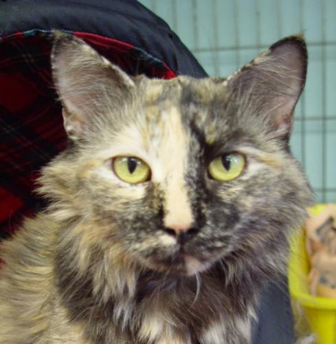

# gft (general fine-tuning): gft_predict

<h1>Inference: gft_predict</h1>

<i>gft_predict</i> reads input from a dataset argument or <i>stdin</i>.
Output to <i>stdout</i>.

gft functions take 4 arguments:
<ol>
<li>--data</li>
<li>--model</li>
<li>--eqn</li>
<li>--task: text-classification (classify/sentiment), token-classification (classify_tokens, ner, pos_tagging), fill-mask, text-generation, machine translation (MT), classify_tokens (question-answering, QA), translation (MT), ctc (automatic-speech-recognition, ASR), image-classification</li>
</ol>

Since the terminology for tasks is currently in a state of flux,
<i>gft</i> supports a number of variants, as illustrated in the examples below.

<h2>Examples of --task argument</h2>

Here are some examples of --task argument (and --model argument):

<h3>Text Classification</h3>

```sh
# text-classification: sentiment analysis
echo 'I love you.' | gft_predict --task H:text-classification
# I love you.	POSITIVE	0.9998705387115479

# same as above but with PaddleNLP
echo 'I love you.' | gft_predict --task P:sentiment
# I love you.	positive	0.785

# text-classification: emotion classification
model=H:AdapterHub/bert-base-uncased-pf-emotion
echo 'I love you.' | gft_predict --model $model --task H:text-classification
# I love you.	love	0.6005669236183167

# --return_all_scores
echo 'I love you' | gft_predict --model $emotion --return_all_scores 2>/dev/null
# I love you	anger	0.00220660911872983	disgust	0.0011457924265414476	fear	0.0005955399246886373	joy	0.9687249660491943	neutral	0.005502483807504177	sadness	0.016927149146795273	surprise	0.004897605162113905
```

<h3>Token Classification</h3>

```sh
# token-classification: NER (Named Entity Recognition)
echo 'I love New York.' | gft_predict --task H:token-classification
# I love New York.	New/I-LOC:0.9989	York/I-LOC:0.9974

# part of speech (POS) tagging
m=vblagoje/bert-english-uncased-finetuned-pos
echo 'I love you' | gft_predict --model H:$m --task token-classification

# insert punctuation
m=Qishuai/distilbert_punctuator_en
echo 'I love you' | gft_predict --model H:$m --task token-classification

# NER with PaddleNLP
echo 'I love you.' | gft_predict --task P:ner
# I love you.	I/词汇用语  /w love/词汇用语  /w you/词汇用语 ./w

# Part of speech tagging with PaddleNLP
echo 'I love you.' | gft_predict --task P:pos_tagging
# I love you.	I/xc  /w love/n  /w you/xc ./w
```

<h3>Mask Filling</h3>

```sh
# fill-mask: guess the masked word
echo 'I <mask> you.' | gft_predict --task H:fill-mask
# I <mask> you.	 salute|0.241	 miss|0.177	 love|0.147	 thank|0.060	 applaud|0.047

echo 'I <mask> you' | gft_predict --task fill-mask --top_k 10 2>/dev/null
# I <mask> you	 miss|0.295	 love|0.174	 salute|0.158	 thank|0.066	 appreciate|0.029	 congratulate|0.027	 applaud|0.023	 dare|0.020	 commend|0.016	 envy|0.013
```

<h3>Sentence Similarity</h3>

```sh
echo 'This is a test|blah blah|That was a test' | 
gft_predict --task H:sentence-similarity --model sentence-transformers/allenai-specter
```

<h3>Feature Extraction</h3>

```sh
echo 'This is a test|blah blah|That was a test' | 
gft_predict --task H:feature-extraction --model allenai/specter
```

<h3>Text Generation</h3>

```sh
# text-generation 
echo 'I love ' | gft_predict --task H:text-generation 
# I love you and I will never be forgotten and thank you." I was also
# inspired by all of the students who walked onto campus wearing these
#  teddy I love the idea that you can be anything people ask for you
```

<h3>Translation</h3>

```sh
# translation
# English (en) --> French (fr)
echo 'I love you.' | gft_predict --task H:translation --model H:Helsinki-NLP/opus-mt-en-fr
# I love you.	Je t'aime.

# English (en) --> Chinese (zh)
echo 'I love you.' | gft_predict --task H:translation --model H:Helsinki-NLP/opus-mt-en-zh
I love you.	我爱你

# Chinese (zh) --> English (en)
echo '我爱你' | gft_predict --task H:translation --model H:Helsinki-NLP/opus-mt-zh-en
# 我爱你	I love you.
```

<h3>Image Classification</h3>

<a href="image.md">Image Classification</a>

<h3>Speech Recognition</h3>

<h2>Input from stdin</h2>

```sh
cd $gft/doc/objects/wav/TIMIT; 
ls *.WAV | sed 3q | gft_predict --task ASR 2>/dev/null
```

<table>
<tr><th>filename</th><th>prediction (yhat)</th></tr>
<tr><td>SA1.WAV	</td><td> SHE HAD YOUR DARK SUIT AND GREASY WASHWATER ALL YEAR</td>/</tr>
<tr><td>SA2.WAV	</td><td>DON'T ASK ME TO CARRY AN OILY RAG LIKE THAT</td>/</tr>
<tr><td>SI1129.WAV	</td><td> THIS GROUP IS SECULARIST AND THEIR PROGRAMM TENDS TO BE TECHNOLOGICAL</td>/</tr>
</table>

<h2>Input from dataset</h2>

```sh
gft_predict --eqn 'ASR:text~file' \
	    --data H:timit_asr \
	    --split test 2>/dev/null |
    awk -F/ '{print $NF}' | sed 3q
```

<table>
<tr><th>filename</th><th>gold</th><th>prediction (yhat)</th></tr>
<tr><td>SX139.WAV</td><td>	The bungalow was pleasantly situated near the shore.</td><td>	THE BUNGALOW WAS PLEASANTLY SITUATED NEAR THE SHORE</td>/</tr>
<tr><td>SA2.WAV	</td><td>Don't ask me to carry an oily rag like that.	</td><td>DON'T ASK ME TO CARRY AN OILY RAG LIKE THAT</td>/</tr>
<tr><td>SX229.WAV	</td><td>Are you looking for employment?</td><td>	ARE YOU LOOKING FOR EMPLOYMENT</td>/</tr>
</table>

<h2>Examples of --data (and --split) arguments</h2>

gft_predict reads input from either stdin or from --data argument, as illustrated below:

```sh
gft_predict --data H:dair-ai/emotion --split test \
	    --eqn 'classify: label ~ text' \
	    2>/dev/null | sed 3q
# im feeling rather rotten so im not very ambitious right now	0	NEGATIVE	0.9998108744621277
# im updating my blog because i feel shitty	0	NEGATIVE	0.9994602799415588
# i never make her separate from me because i don t ever want her to feel like i m ashamed with her	0	POSITIVE	0.9993082284927368
```

Different models output different labels.

```sh
model=H:AdapterHub/bert-base-uncased-pf-emotion
gft_predict --data H:dair-ai/emotion --split test \
	    --eqn 'classify: label ~ text' \
	    --model $model \
	    2>/dev/null | sed 3q
# im feeling rather rotten so im not very ambitious right now	0	sadness	0.9994989633560181
# im updating my blog because i feel shitty	0	sadness	0.9999173879623413
# i never make her separate from me because i don t ever want her to feel like i m ashamed with her	0	sadness	0.9998934268951416
```

```sh
model=H:nickmuchi/vit-base-beans
gft_predict --data H:beans --split test --eqn 'classify_images: labels ~ image_file_path'  --model $model 2>/dev/null | sed 3q
# /mnt/home/kwc/.cache/huggingface/datasets/downloads/extracted/e1ef5153340110220a8d57a4cc8ed610ee3184bda34d0d4ad54ede3854e45450/test/healthy/healthy_test.21.jpg	2	joy	0.9346660375595093
# /mnt/home/kwc/.cache/huggingface/datasets/downloads/extracted/e1ef5153340110220a8d57a4cc8ed610ee3184bda34d0d4ad54ede3854e45450/test/healthy/healthy_test.35.jpg	2	joy	0.9286789298057556
# /mnt/home/kwc/.cache/huggingface/datasets/downloads/extracted/e1ef5153340110220a8d57a4cc8ed610ee3184bda34d0d4ad54ede3854e45450/test/healthy/healthy_test.34.jpg	2	joy	0.917587399482727
```

<h2>Examples of --model argument</h2>

<h3>Fake News</h3>


```sh
# Run a half-dozen fake-news classifiers on  "I love you."
lab=$gft/huggingface_hub/huggingface_models_with_labels.txt
for model in `egrep fake $lab | cut -f1`
     do
     out=`echo 'I love you.' | gft_predict --task H:text-classification --model $model 2>/dev/null`
     echo $model $out
     done
# elozano/bert-base-cased-fake-news I love you. Fake 0.9996728897094727
# Narrativaai/fake-news-detection-spanish I love you. FAKE 0.9591125845909119
# dtam/autonlp-covid-fake-news-36839110 I love you. 1 0.999913215637207
# Qinghui/autonlp-fake-covid-news-36769078 I love you. 1 0.9999946355819702
# Qiaozhen/fake-news-detector I love you. fake 0.9575745463371277
# yaoyinnan/roberta-fakeddit I love you. Fake 0.9857746362686157
```

```sh
# Run a half-dozen sentiment classifiers on  "I love you."
lab=$gft/huggingface_hub/huggingface_models_with_labels.txt
# Since there are so many (196) classifiers, take a random sample of 6
egrep -ci positive $lab
# 196
models=`awk 'NF < 5' $lab | egrep -i positive  | 
	awk '{print rand() "\t" $0}' | sort | cut -f2- | sed 6q | cut -f1`
for model in $models
     do
     out=`echo 'I love you.' | gft_predict --task H:text-classification --model $model 2>/dev/null`
     echo $model $out
     done
# rohansingh/autonlp-Fake-news-detection-system-29906863 I love you. positive 0.6512816548347473
# gchhablani/fnet-base-finetuned-sst2 I love you. positive 0.9974162578582764
# cointegrated/rubert-tiny-sentiment-balanced I love you. positive 0.9445993304252625
# SetFit/deberta-v3-large__sst2__train-8-5 I love you. positive 0.8264811635017395
# bowipawan/bert-sentimental I love you. positive 0.7457774877548218
# m3tafl0ps/autonlp-NLPIsFun-251844 I love you. positive 0.9010641574859619
```

<table>
<tr><td colspan="4" style="background-color:yellow;"> <i>I love you</i> is <b>positive<b></td><tr>
<tr> <th> <b>Predicted Label</b></th> <th><b>Score</b></th> <th><b>Model</b> </th> <th> <b>Labels for Model</b></th></tr>
<tr><td>positive</td> <td>0.512</td> <td>SetFit/deberta-v3-large__sst2__train-16-7</td><td>negative, positive</td></tr>
<tr><td>POSITIVE</td> <td>0.871</td> <td>ayameRushia/roberta-base-indonesian-sentiment-analysis-smsa</td><td>POSITIVE, NEUTRAL, NEGATIVE</td></tr>
<tr><td>positive</td> <td>0.807</td> <td>SetFit/distilbert-base-uncased__sst2__train-32-2</td><td>negative, positive</td></tr>
<tr><td>positive</td> <td>0.999</td> <td>AdapterHub/bert-base-uncased-pf-sst2</td><td>negative, positive</td></tr>
<tr><td>positive</td> <td>0.917</td> <td>SetFit/deberta-v3-large__sst2__train-32-1</td><td>negative, positive</td></tr>
<tr><td>positive</td> <td>0.999</td> <td>moshew/tiny-bert-aug-sst2-distilled</td><td>negative, positive</td></tr>
<tr><td>positive</td> <td>0.651</td> <td>rohansingh/autonlp-Fake-news-detection-system-29906863</td><td>negative, positive</td></tr>
<tr><td>5 stars</td> <td>0.872</td> <td>tomato/sentiment_analysis</td><td>1 star, 2 stars, 3 stars, 4 stars, 5 stars</td></tr>
<tr><td>5 stars</td> <td>0.424</td> <td>cmarkea/distilcamembert-base-sentiment</td><td>1 star, 2 stars, 3 stars, 4 stars, 5 stars</td></tr>
<tr><td>5 stars</td> <td>0.872</td> <td>nlptown/bert-base-multilingual-uncased-sentiment</td><td>1 star, 2 stars, 3 stars, 4 stars, 5 stars</td></tr>
</table>
<table>
<tr><td colspan="4" style="background-color:yellow;"> <i>I love you</i> is <b>love</b> and/or <b>joy<b></td></tr>
<tr> <th> <b>Predicted Label</b></th> <th><b>Score</b></th> <th><b>Model</b> </th> <th> <b>Labels for Model</b></th></tr>
<tr><td>joy</td> <td>0.826</td> <td>philschmid/deberta-v3-xsmall-emotion</td><td>anger, fear, joy, love, sadness, surprise</td></tr>
<tr><td>love</td> <td>0.681</td> <td>AdapterHub/roberta-base-pf-emotion</td><td>sadness, joy, love, anger, fear, surprise</td></tr>
<tr><td>joy</td> <td>0.786</td> <td>philschmid/MiniLMv2-L6-H384-emotion</td><td>sadness, joy, love, anger, fear, surprise</td></tr>
<tr><td>love</td> <td>0.649</td> <td>bhadresh-savani/roberta-base-emotion</td><td>sadness, joy, love, anger, fear, surprise</td></tr>
<tr><td>love</td> <td>0.935</td> <td>bhadresh-savani/albert-base-v2-emotion</td><td>anger, fear, joy, love, sadness, surprise</td></tr>
<tr><td>love</td> <td>0.960</td> <td>marcelcastrobr/sagemaker-distilbert-emotion-2</td><td>sadness, joy, love, anger, fear, surprise</td></tr>
</table>
<table>
<tr><td colspan="4" style="background-color:yellow;"> <i>I love you</i> is <b>fake news<b></td></tr>
<tr> <th> <b>Predicted Label</b></th> <th><b>Score</b></th> <th><b>Model</b> </th> <th> <b>Labels for Model</b></th></tr>
<tr><td>Fake</td> <td>0.998</td> <td>yaoyinnan/bert-base-chinese-covid19</td><td>Neutral, Fake, Real</td></tr>
<tr><td>Fake</td> <td>0.986</td> <td>yaoyinnan/roberta-fakeddit</td><td>Fake, Real</td></tr>
<tr><td>fake</td> <td>0.958</td> <td>Qiaozhen/fake-news-detector</td><td>real, fake</td></tr>
<tr><td>FAKE</td> <td>0.959</td> <td>Narrativaai/fake-news-detection-spanish</td><td>REAL, FAKE</td></tr>
</table>
<table>
<tr><td colspan="4" style="background-color:yellow;"> <i>I love you</i> is both <b>spam</b> and <b>ham</b></td></tr>
<tr> <th> <b>Predicted Label</b></th> <th><b>Score</b></th> <th><b>Model</b> </th> <th> <b>Labels for Model</b></th></tr>
<tr><td>spam</td> <td>0.826</td> <td>SetFit/distilbert-base-uncased__enron_spam__all-train</td><td>ham, spam</td></tr>
<tr><td>not spam</td> <td>1.000</td> <td>sureshs/distilbert-large-sms-spam</td><td>not spam, spam</td></tr>
</table>
<table>
<tr><td colspan="4" style="background-color:yellow;"> <i>I love you</i> is (mostly) not <b>hateful/offensive</b></td></tr>
<tr> <th> <b>Predicted Label</b></th> <th><b>Score</b></th> <th><b>Model</b> </th> <th> <b>Labels for Model</b></th></tr>
<tr><td>not-hate</td> <td>0.974</td> <td>aXhyra/demo_hate_1234567</td><td>not-hate, hate</td></tr>
<tr><td>neither</td> <td>0.349</td> <td>SetFit/distilbert-base-uncased__hate_speech_offensive__train-16-9</td><td>hate speech, offensive language, neither</td></tr>
<tr><td>not-hate</td> <td>0.990</td> <td>aXhyra/presentation_hate_31415</td><td>not-hate, hate</td></tr>
<tr><td>no hate speech</td> <td>0.885</td> <td>SetFit/distilbert-base-uncased__ethos_binary__all-train</td><td>no hate speech, hate speech</td></tr>
<tr><td>not-hate</td> <td>0.995</td> <td>aXhyra/hate_trained_42</td><td>not-hate, hate</td></tr>
<tr><td>hateful</td> <td>0.040</td> <td>pysentimiento/robertuito-hate-speech</td><td>hateful, targeted, aggressive</td></tr>
<tr><td>offsenive language</td> <td>0.336</td> <td>SetFit/distilbert-base-uncased__hate_speech_offensive__train-32-1</td><td>hate speech, offensive language, neither</td></tr>
<tr><td>offensive</td> <td>1.000</td> <td>simjo/model1_test</td><td>not offensive, offensive</td></tr>
<tr><td>OFFENSIVE</td> <td>0.546</td> <td>seanbenhur/tanglish-offensive-language-identification</td><td>NOT-OFFENSIVE, OFFENSIVE</td></tr>
<tr><td>neither</td> <td>0.365</td> <td>SetFit/distilbert-base-uncased__hate_speech_offensive__train-8-6</td><td>hate speech, offensive language, neither</td></tr>
<tr><td>offensive language</td> <td>1.000</td> <td>simjo/dummy-model</td><td>not offensive, offensive</td></tr>
<tr><td>hate speech</td> <td>0.350</td> <td>SetFit/distilbert-base-uncased__hate_speech_offensive__train-8-7</td><td>hate speech, offensive language, neither</td></tr>
</table>


<p>
Design goals/benefits of higher level languages such as <i>gft</i>:
<ol>

<li> Hide complexity: <i>gft</i> programs should be short (1-line) and easy to read. </li>

<li> Avoid special cases (especially in code that is exposed to users): Standard examples
such as <a href="https://github.com/huggingface/transformers/tree/master/examples">these</a>
and <a href="https://github.com/PaddlePaddle/PaddleNLP">these</a>
and longer than <i>gft</i> programs.  In many cases, 500 lines of pytorch code
can be reduced to a single line of <i>gft</i> code.  
These 500 lines of code contain many details that users do not need to know about
such as data loading, gradient descent training, and much more.
Many of these examples are very similar to one another.  Avoid duplication in
code that is exposed to large numbers of users.
</li>

<li> Code re-use: The standard examples are full of opportunities for code reuse.
The user is expected to fork the code in these examples and modify them as needed if they
want the examples to work on slightly different tasks, or slightly
different datasets.  When users modify the 500 lines of code, there will
introduce bugs.  Code reuse is safer than
editing examples.  Since the <i>gft</i> tools are based closely on these
examples, they should produce similar results, with similiar
computational resources (space and time), since both solutions are
basically running the same algorithms (and much of the same code).
</li>

<li> Flexibility/Generality: Support most datasets and models
published on hubs (HuggingFace, PaddleNLP).  The prefixes, <i>H</i>, <i>P</i> and <i>C</i>,
refer to HuggingFace, PaddleNLP and custom (local filesystem).  You
should be able to mix and match models and datasets from different
sources (<a href="https://huggingface.co/">HuggingFace</a>, <a
href="https://www.paddlepaddle.org.cn/hublist">PaddleHub/PaddleNLP</a>,
<a href="https://adapterhub.ml/">Adapter Hub</a>, etc.)  There are
currently about 30k models and 3k datasets on these hubs.  <i>gft</i> hides
complexities such as different formats for models from different
suppliers, and different types of auto classes for different purposes.
For example, users should not need to know about adapter models, and
how they are different from other types of models.</li>
</ol>


<h1 id="inference">Inference (with more details)</h1>

<i>gft_predict</i> reads from stdin and applies almost any input to almost any model.
See documentation on <a href="https://huggingface.co/docs/transformers/v4.16.2/en/main_classes/pipelines">HuggingFace pipelines</a>
<strike>
and <a href="https://github.com/PaddlePaddle/PaddleNLP#taskflow%E5%BC%80%E7%AE%B1%E5%8D%B3%E7%94%A8%E7%9A%84%E4%BA%A7%E4%B8%9A%E7%BA%A7nlp%E8%83%BD%E5%8A%9B">PaddleNLP taskflow</a>
</strike>
for more information on </i>--task</i> argument.
<p>
Example of usage of inference scripts:

<ol>
<li><a href="#TC">text-classification </a> : The left hand side (lhs) of the equation is a single variable over classes. </li>
<li><a href="#tokenClassification">token-classification </a> : The lhs has a class variable for each token. </li>
<li><a href="#MT"> translation </a>: Machine Translation </li>
<li><a href="#fill"> fill-mask </a>: Replace "<mask>" with words. </li>
<li><a href=#QA"> question-answering </a>: Example: SQuAD.  The answer is a span (substring) of the input. 
The lhs has two class variables for each position, indicating the start and end of answer spans. </li>
<li><a href="#IC">image-classification</a>: Like text-classification, except the rhs is a picture (as opposed to text).</li>
<li><a href="#ASR">automatic-speech-recognition</a>: ASR</li>
<li><a href="#TG">text-generation</a>: Input prompt and output completion.</li>
</ol>


<h2 id="TC">Text Classification</h2>

```sh
# text classification

# example with --task argument (HuggingFace pipelines do different things with different task arguments)
echo 'I love you.' | gft_predict --model H:AdapterHub/bert-base-uncased-pf-emotion --task H:text-classification 2>/dev/null
# I love you.	love	0.6005669236183167
```

If you don't specify a model, one will be chosen for you (remove the /dev/null bits to see that distilbert-base-uncased-finetuned-sst-2-english is the default model).
Different models produce different classifications.  The default model produces positive and negative labels (sentiment).

```sh
echo 'I love you.' | gft_predict --task H:text-classification 2>/dev/null
# I love you.	POSITIVE	0.9998705387115479
echo 'I hate you.' | gft_predict --task H:text-classification 2>/dev/null
# I hate you.	NEGATIVE	0.9992952346801758
```

If you don't specify a <i>--task</i>, the class labels will be numeric, and the last field will
be a list of logits.  The class label is the argmax of the logits.

```sh
# default arguments: input is assigned to class 2 of 6 (number of classes is part of the model which was fine-tuned on data with 6 classes)
echo 'I love you.' | gft_predict --model H:AdapterHub/bert-base-uncased-pf-emotion 2>/dev/null
# I love you.	2	-0.2438915|4.8194537|5.235088|-1.7891347|-4.2359033|-5.1401916

echo 'I love you.' | gft_predict --model H:distilbert-base-uncased-finetuned-sst-2-english
# I love you.	1	-4.294976|4.6575847

echo 'I love you.' | gft_predict --model H:distilbert-base-uncased-finetuned-sst-2-english
# I hate you	0	3.8723779|-3.1543205
```
<h2 id="tokenClassification">Token Classification</h2>

```sh
echo 'I love New York.' | gft_predict --task H:token-classification --model vblagoje/bert-english-uncased-finetuned-pos 2>/dev/null
# I love New York.	i/PRON:0.9995	love/VERB:0.9989	new/PROPN:0.9986	york/PROPN:0.9988	./PUNCT:0.9997

echo 'I love New York.' | gft_predict --task H:token-classification 2>/dev/null
# I love New York.	New/I-LOC:0.9989	York/I-LOC:0.9974
```

<h2 id="MT">Machine Translation</h2>
```sh
# more examples of --task argument

# Machine Translation
# Language pair is encoded in the model; there are models in HuggingFace for many language pairs
echo 'I love you.' | gft_predict --task H:translation --model H:Helsinki-NLP/opus-mt-en-fr 2>/dev/null
# I love you.	Je t'aime.
echo 'I love you.' | gft_predict --task H:translation --model H:Helsinki-NLP/opus-mt-en-zh 2>/dev/null
I love you.	我爱你
```

<h2 id="fill"> Fill Mask </h2>
```sh
# fill mask: replace <mask> with n-best words
echo 'I <mask> you.' | gft_predict --task H:fill-mask 2>/dev/null
# I <mask> you.	 salute|0.241	 miss|0.177	 love|0.147	 thank|0.060	 applaud|0.047
```

<h2 id="QA">Question Answering</h2>

```sh
# Question Answering (SQuAD)
# Extract one example from the SQuAD dataset
gft_dataset --data H:squad --eqn 'classify_spans: answers ~ question + context'  --split val | sed 1q > /tmp/x

# Run inference on this example (and show the first 150 characters of each field on separate lines)
gft_predict --task H:question-answering --model H:$model < /tmp/x | tr '\t' '\n' | cut -c1-150
# Which NFL team represented the AFC at Super Bowl 50?|Super Bowl 50 was an American football game to determine the champion of the National Football Le
# {'text': ['Denver Broncos', 'Denver Broncos', 'Denver Broncos'], 'answer_start': [177, 177, 177]}
# answer: Denver Broncos

```

<h2 id="IC">Image Classification</h2>


```sh
# image classification
echo https://images.all-free-download.com/images/graphicwebp/funny_cat_194619.webp |
gft_predict --task H:image-classification 2>/dev/null
# https://images.all-free-download.com/images/graphicwebp/funny_cat_194619.webp	Egyptian cat|0.736	tiger cat|0.039	tabby, tabby cat|0.031	lynx, catamount|0.024	Persian cat|0.023

echo https://huggingface.co/datasets/huggingface/documentation-images/resolve/main/pipeline-cat-chonk.jpeg | 
gft_predict --task H:image-classification 2>/dev/null
# https://huggingface.co/datasets/huggingface/documentation-images/resolve/main/pipeline-cat-chonk.jpeg	lynx, catamount|0.433	cougar, puma, catamount, mountain lion, painter, panther, Felis concolor|0.035	snow leopard, ounce, Panthera uncia|0.032	Egyptian cat|0.024	tiger cat|0.023
```





```sh
gft_dataset --eqn 'classify: labels ~ file' --data H:nateraw/auto-cats-and-dogs --split train | head > /tmp/x
cat /tmp/x | gft_predict --task H:image-classification 2>/dev/null | awk -F/ '{print $NF}'
# 0.jpg	0	Egyptian cat|0.327	tiger cat|0.097	tabby, tabby cat|0.057	space heater|0.053	laptop, laptop computer|0.029
# 1.jpg	0	tabby, tabby cat|0.612	Egyptian cat|0.284	tiger cat|0.094	lynx, catamount|0.003	Siamese cat, Siamese|0.000
# 10.jpg	0	tabby, tabby cat|0.435	Egyptian cat|0.251	tiger cat|0.085	Persian cat|0.081	lynx, catamount|0.060
# 100.jpg	0	Egyptian cat|0.441	tabby, tabby cat|0.396	tiger cat|0.086	lynx, catamount|0.022	Persian cat|0.012
# 1000.jpg	0	Egyptian cat|0.369	tabby, tabby cat|0.129	tiger cat|0.107	Angora, Angora rabbit|0.053	Persian cat|0.042
# 10000.jpg	0	Egyptian cat|0.753	tabby, tabby cat|0.203	tiger cat|0.040	lynx, catamount|0.002	Siamese cat, Siamese|0.000
# 10001.jpg	0	Egyptian cat|0.321	tabby, tabby cat|0.061	Persian cat|0.053	tiger cat|0.033	bucket, pail|0.025
# 10002.jpg	0	Egyptian cat|0.581	tabby, tabby cat|0.222	tiger cat|0.096	lynx, catamount|0.044	Persian cat|0.019
# 10003.jpg	0	Egyptian cat|0.765	tabby, tabby cat|0.118	tiger cat|0.084	Siamese cat, Siamese|0.002	carton|0.002
# 10004.jpg	0	tabby, tabby cat|0.476	Egyptian cat|0.298	tiger cat|0.218	lynx, catamount|0.001	Siamese cat, Siamese|0.000
```

The results are much better if we replace the default model with a more appropriate model.

```sh
model=nateraw/vit-base-cats-vs-dogs
cat /tmp/x | gft_predict --model=$model --task H:image-classification | awk -F/ '{print $NF}'
# 0.jpg	0	cat|0.999	dog|0.001
# 1.jpg	0	cat|1.000	dog|0.000
# 10.jpg	0	cat|1.000	dog|0.000
# 100.jpg	0	cat|1.000	dog|0.000
# 1000.jpg	0	cat|1.000	dog|0.000
# 10000.jpg	0	cat|1.000	dog|0.000
# 10001.jpg	0	cat|1.000	dog|0.000
# 10002.jpg	0	cat|1.000	dog|0.000
# 10003.jpg	0	cat|0.999	dog|0.001
# 10004.jpg	0	cat|1.000	dog|0.000
```


```sh
gft_dataset --eqn 'classify: labels ~ image_file_path' --data H:beans | head  > /tmp/x
cat /tmp/x | gft_predict --task H:image-classification 2>/dev/null | awk -F/ '{print $NF}'
# healthy_test.21.jpg	2	fig|0.696	cucumber, cuke|0.013	pot, flowerpot|0.009	custard apple|0.007	leaf beetle, chrysomelid|0.005
# healthy_test.35.jpg	2	bell pepper|0.094	leaf beetle, chrysomelid|0.065	cucumber, cuke|0.058	head cabbage|0.049	ant, emmet, pismire|0.022
# healthy_test.34.jpg	2	cucumber, cuke|0.156	head cabbage|0.074	pot, flowerpot|0.022	ear, spike, capitulum|0.021	corn|0.010
# healthy_test.20.jpg	2	fig|0.848	pot, flowerpot|0.005	custard apple|0.003	jackfruit, jak, jack|0.002	cucumber, cuke|0.002
# healthy_test.36.jpg	2	custard apple|0.072	pot, flowerpot|0.057	fig|0.033	wool, woolen, woollen|0.025	necklace|0.013
# healthy_test.22.jpg	2	pick, plectrum, plectron|0.030	shower cap|0.012	leaf beetle, chrysomelid|0.011	head cabbage|0.008	spatula|0.007
# healthy_test.23.jpg	2	leaf beetle, chrysomelid|0.172	cucumber, cuke|0.049	ladybug, ladybeetle, lady beetle, ladybird, ladybird beetle|0.043	corn|0.031	bell pepper|0.029
# healthy_test.37.jpg	2	cucumber, cuke|0.235	head cabbage|0.021	zucchini, courgette|0.015	fig|0.014	corn|0.012
# healthy_test.8.jpg	2	leaf beetle, chrysomelid|0.051	cucumber, cuke|0.045	head cabbage|0.023	ladybug, ladybeetle, lady beetle, ladybird, ladybird beetle|0.010	fig|0.009
# healthy_test.33.jpg	2	cucumber, cuke|0.152	leaf beetle, chrysomelid|0.111	lacewing, lacewing fly|0.031	zucchini, courgette|0.030	fig|0.022
```

<h2 id="ASR">Speech Recognition</h2>

```sh
# speech recognition
gft_dataset --eqn 'ctc: text ~ file' --data H:timit_asr | head  > /tmp/x
cat /tmp/x | gft_predict --task H:automatic-speech-recognition 2>/dev/null | awk -F/ '{print $NF}'
# SX139.WAV	The bungalow was pleasantly situated near the shore.	THE BUNGALOW WAS PLEASANTLY SITUATED NEAR THE SHORE
# SA2.WAV	Don't ask me to carry an oily rag like that.	DON'T ASK ME TO CARRY AN OILY RAG LIKE THAT
# SX229.WAV	Are you looking for employment?	ARE YOU LOOKING FOR EMPLOYMENT
# SA1.WAV	She had your dark suit in greasy wash water all year.	SHE HAD YOUR DARK SUIT AND GREASY WASHWATER ALL YEAR
# SX49.WAV	At twilight on the twelfth day we'll have Chablis.	AT TWILIGHT ON THE TWELFTH DAY WE'LL HAVE CHABLI
# SX409.WAV	Eating spinach nightly increases strength miraculously.	EATING SPINACH NIGHTLY INCREASES STRENGTH MIRACULOUSLY
# SI1759.WAV	Got a heck of a buy on this, dirt cheap.	GOT A HECK OF A BY ON THIS DIRT CHEAP
# SI499.WAV	The scalloped edge is particularly appealing.	THE SCALLOPED EDGE IS PARTICULARLY APPEALING
# SX319.WAV	A big goat idly ambled through the farmyard.	A BIG GOAT IDLY AMBLED THROUGH THE FARMYARD
# SI1129.WAV	This group is secularist and their program tends to be technological.	THIS GROUP IS SECULARIST AND THEIR PROGRAMM TENDS TO BE TECHNOLOGICAL
```

<h2 id="TG">Text Generation</h2>

```sh
# text generation
echo 'A robin is a' | gft_predict --task H:text-generation --max_length 15 --num_return_sequences 1 2>/dev/null
# A robin is a	A robin is a cat or dog that has trouble keeping up with its

# NOTE: non-determinism; same prompt --> different completions
echo 'A robin is a' | gft_predict --task H:text-generation --max_length 15 --num_return_sequences 1 2>/dev/null
# A robin is a	A robin is a small bird that runs at a range where its legs
```

<p>

More examples of inference are <a href="examples/inference_examples">here</a>.  Lots of
examples on <a href="https://gluebenchmark.com/">GLUE</a> are <a
href="examples/inference_examples/model.HuggingFace/language/data.HuggingFace/their_models/glue">here</a>.

