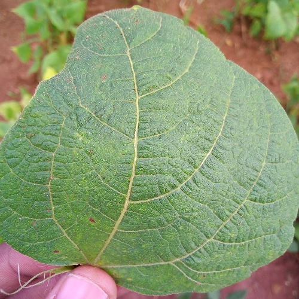

> image classification

<h3>Image Classification</h3>

```sh
url="https://images.all-free-download.com/images/graphicwebp/funny_cat_194619.webp"
echo $url | gft_predict --task H:image-classification
https://images.all-free-download.com/images/graphicwebp/funny_cat_194619.webp	Egyptian cat|0.736	tiger cat|0.039	tabby, tabby cat|0.031	lynx, catamount|0.024	Persian cat|0.023
```

The results are more reasonable if we replace the default model with a more appropriate model:

```sh
url="https://images.all-free-download.com/images/graphicwebp/funny_cat_194619.webp"
echo $url | gft_predict --task H:image-classification --model H:nateraw/vit-base-cats-vs-dogs
https://images.all-free-download.com/images/graphicwebp/funny_cat_194619.webp	cat|1.000	dog|0.000
```

<table><tr><th>Funny Cat</th><th>Cat Chonk</th></tr>
<tr><td> </td>
    <td> </td></tr></table>


There are a few images (and audio files) under $gft/doc/sections/arguments/inputs/objects.  Some of these images are shown below:

<table>
	<tr><th>PetImages/0.jpg</th><th>PetImages/10000.jpg</th><th>PetImages/10001.jpg</th></tr>
	<tr>
	<td></td>
	<td></td>
        <td></td></tr>

	<tr><th>beans/healthy_test.20.jpg</th><th>beans/healthy_test.21.jpg</th><th>beans/healthy_test.22.jpg</th></tr>
	<tr><td></td>
	    <td></td>
	    <td></td></tr>
</table>


Inputs can also come from file names on the local file system (as well as URLs):


```sh
model=H:nateraw/vit-base-cats-vs-dogs
ls $gft/doc/sections/arguments/inputs/objects/images/PetImages/* | sed 3q | 
   gft_predict --task H:image-classification --model $model 2>/dev/null
> /mnt/home/kwc/gft7/gft/doc/objects/images/PetImages/0.jpg	cat|0.999	dog|0.001
> /mnt/home/kwc/gft7/gft/doc/objects/images/PetImages/10000.jpg	cat|1.000	dog|0.000
> /mnt/home/kwc/gft7/gft/doc/objects/images/PetImages/10001.jpg	cat|1.000	dog|0.000

model=H:nickmuchi/vit-base-beans
ls $gft/doc/sections/arguments/inputs/objects/images/beans/* | sed 3q | 
   gft_predict --task H:image-classification --model $model 2>/dev/null
> images/beans/healthy_test.20.jpg	healthy|0.996	angular_leaf_spot|0.002	bean_rust|0.002
> images/beans/healthy_test.21.jpg	healthy|0.996	angular_leaf_spot|0.002	bean_rust|0.002
> images/beans/healthy_test.22.jpg	healthy|0.996	angular_leaf_spot|0.002	bean_rust|0.002
```

Inputs can also come from datasets (as well as files and URLs):

```sh
model=H:nickmuchi/vit-base-beans
gft_predict --eqn 'image_classification:labels~image_file_path' \
	    --data H:beans --model \
	    $model --split test | 
    awk -F/ '{print $NF}' | sed 3q
> angular_leaf_spot_test.22.jpg	0	angular_leaf_spot|0.996	healthy|0.003	bean_rust|0.002
> angular_leaf_spot_test.13.jpg	0	angular_leaf_spot|0.996	bean_rust|0.002	healthy|0.002
> angular_leaf_spot_test.40.jpg	0	angular_leaf_spot|0.996	healthy|0.002	bean_rust|0.002
```

The --split and --eqn arguments are required when inputs come from datasets.  gft_summary
is often helpful for figuring out which split to use, as well as which columns to use in equations.


```sh
gft_summary --data H:beans
> dataset: beans	dataset: beans	downloads: 1733	likes: 0	
> dataset: beans	splits: train: 1034 rows, test: 128 rows, val: 133 rows
> dataset: beans	split: train	columns: image_file_path, image, labels
> dataset: beans --> 8 models
> dataset: beans	model: nateraw/vit-base-beans	downloads: 26	likes: 3	task: image-classification
> dataset: beans	model: nateraw/timm-resnet18-beans-test	downloads: 21	likes: 0	task: image-classification
> dataset: beans	model: nateraw/resnet50-beans-dummy-sagemaker	downloads: 20	likes: 0	task: image-classification
> dataset: beans	model: nateraw/timm-resnet18-beans-test-2	downloads: 20	likes: 0	task: image-classification
> dataset: beans	model: nickmuchi/vit-base-beans	downloads: 20	likes: 0	task: image-classification
> dataset: beans	model: nateraw/vit-base-beans-demo	downloads: 15	likes: 0	task: image-classification
> dataset: beans	model: nateraw/vit-base-beans-demo-v2	downloads: 11	likes: 0	task: image-classification
> dataset: beans	model: nateraw/vit-base-beans-demo-v3	downloads: 10	likes: 0	task: image-classification
```

